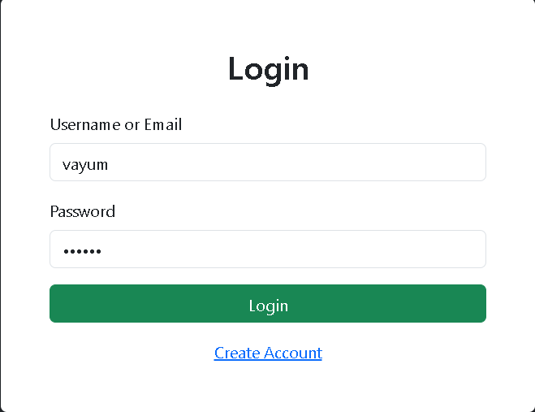
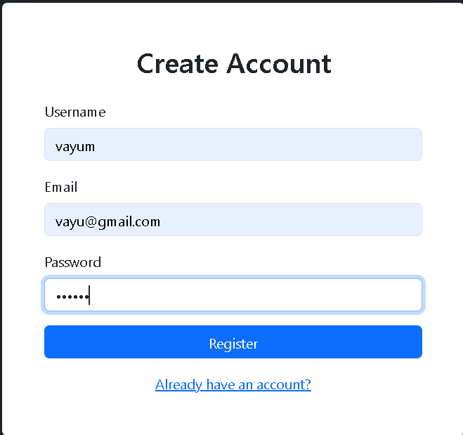
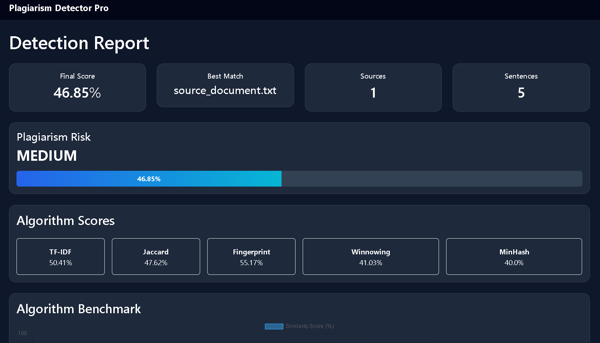
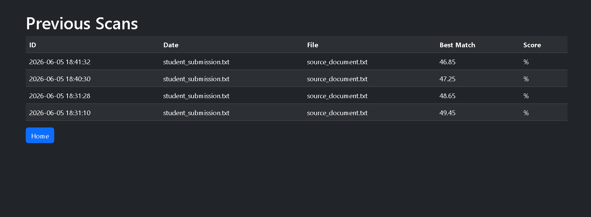

# Plagiarism Detector Using String Matching Algorithms

A comprehensive web-based plagiarism detection system developed using Python and Flask. The application compares submitted documents against multiple source files using advanced text similarity and string matching algorithms, providing accurate plagiarism analysis, detailed reports, and user authentication features.

## Live Demo

**Application:** https://plagiarism-detector-string-matching.onrender.com

**GitHub Repository:** https://github.com/Vayu-143/Plagiarism-Detector-String-Matching

---

## Overview

This project is designed to detect textual plagiarism by applying multiple similarity detection techniques and combining their results into a unified plagiarism score. Users can create accounts, log in securely, upload documents, compare them against reference sources, view similarity metrics, download PDF reports, and access scan history.

The system demonstrates practical implementation of several important algorithms used in information retrieval, document comparison, and plagiarism detection systems.

---

## Features

### User Authentication

* User Registration
* User Login
* Session Management
* User-specific Scan History

### Plagiarism Detection

* TF-IDF Similarity
* Jaccard Similarity
* Fingerprinting
* Winnowing Algorithm
* MinHash Similarity

### Analysis & Reporting

* Overall Similarity Score
* Risk Classification (Low / Medium / High)
* Sentence Similarity Heatmap
* Similarity Visualization Charts
* PDF Report Generation
* Scan History Tracking

### Web Interface

* Modern Responsive UI
* Secure User Workflow
* Multi-file Source Upload
* Downloadable Reports

---

## Algorithms Implemented

### TF-IDF (Term Frequency – Inverse Document Frequency)

Measures textual similarity based on word importance within documents.

### Jaccard Similarity

Calculates similarity by comparing common and unique tokens.

### Fingerprinting

Generates representative fingerprints of documents for efficient matching.

### Winnowing Algorithm

Identifies document fingerprints while reducing noise and preserving significant matches.

### MinHash

Provides approximate similarity estimation for large text datasets.

---

## Project Architecture

```text
User Document
      │
      ▼
Text Preprocessing
      │
      ▼
Sentence Tokenization
      │
      ▼
┌───────────────────────────┐
│ Similarity Algorithms     │
├───────────────────────────┤
│ TF-IDF                    │
│ Jaccard Similarity        │
│ Fingerprinting            │
│ Winnowing                 │
│ MinHash                   │
└───────────────────────────┘
      │
      ▼
Score Aggregation
      │
      ▼
Risk Assessment
      │
      ▼
Visualization & PDF Reports
      │
      ▼
History Storage (SQLite)
```

---

## Technology Stack

### Backend

* Python
* Flask
* SQLite

### Data Processing

* NumPy
* Scikit-Learn

### Visualization

* Matplotlib

### Reporting

* ReportLab

### Frontend

* HTML5
* CSS3
* Jinja2 Templates

### Deployment

* GitHub
* Render

---

## Project Structure

```text
Plagiarism-Detector-String-Matching/
│
├── app.py
├── requirements.txt
├── README.md
│
├── src/
│   ├── database.py
│   ├── preprocess.py
│   ├── tfidf_similarity.py
│   ├── jaccard.py
│   ├── fingerprint.py
│   ├── winnowing.py
│   ├── minhash.py
│   ├── multi_compare.py
│   ├── sentence_similarity.py
│   ├── chart.py
│   └── pdf_report.py
│
├── templates/
│   ├── index.html
│   ├── login.html
│   ├── register.html
│   ├── result.html
│   └── history.html
│
├── static/
│   ├── style.css
│   └── similarity_chart.png
│
├── uploads/
├── reports/
└── docs/
```

---

## Installation

### Clone Repository

```bash
git clone https://github.com/Vayu-143/Plagiarism-Detector-String-Matching.git

cd Plagiarism-Detector-String-Matching
```

### Create Virtual Environment

```bash
python -m venv venv
```

### Activate Environment

#### Windows

```bash
venv\Scripts\activate
```

#### Linux / Mac

```bash
source venv/bin/activate
```

### Install Dependencies

```bash
pip install -r requirements.txt
```

### Run Application

```bash
python app.py
```

Open:

```text
http://127.0.0.1:5000
```

---

## Usage

1. Register a new account.
2. Login using username or email.
3. Upload a submitted document.
4. Upload source/reference documents.
5. Run plagiarism detection.
6. View similarity scores and analysis.
7. Download PDF report.
8. Access previous scans through History.

---

## Screenshots

Add screenshots in the `images/` folder and update paths below.

```md







```

---

## Future Enhancements

* Password Hashing with bcrypt
* File Upload Support (PDF, DOCX)
* AI-assisted Similarity Analysis
* Real-time Highlighted Matches
* Admin Dashboard
* Cloud Database Integration
* API Support

---

## Author

**Vayunandan Mishra**

Computer Science Student | Python Developer

GitHub: https://github.com/Vayu-143

Project Repository:
https://github.com/Vayu-143/Plagiarism-Detector-String-Matching

Live Application:
https://plagiarism-detector-string-matching.onrender.com

---

## License

This project is developed for educational, academic, and learning purposes.
Copyright © 2026 Vayunandan Mishra. All Rights Reserved.
